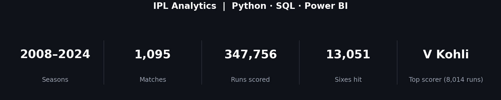
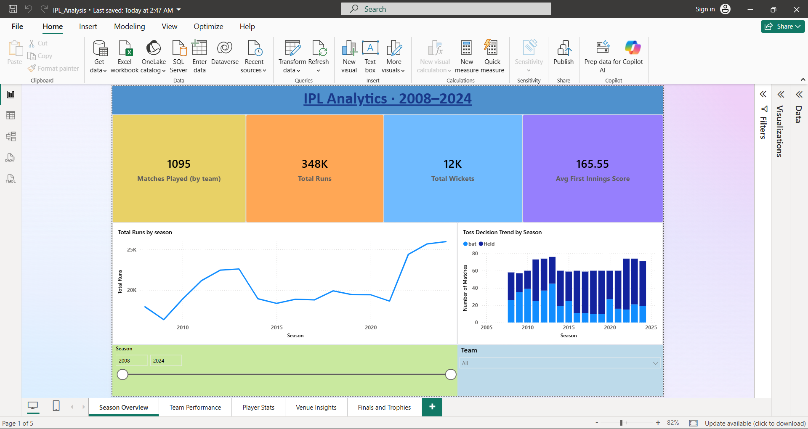
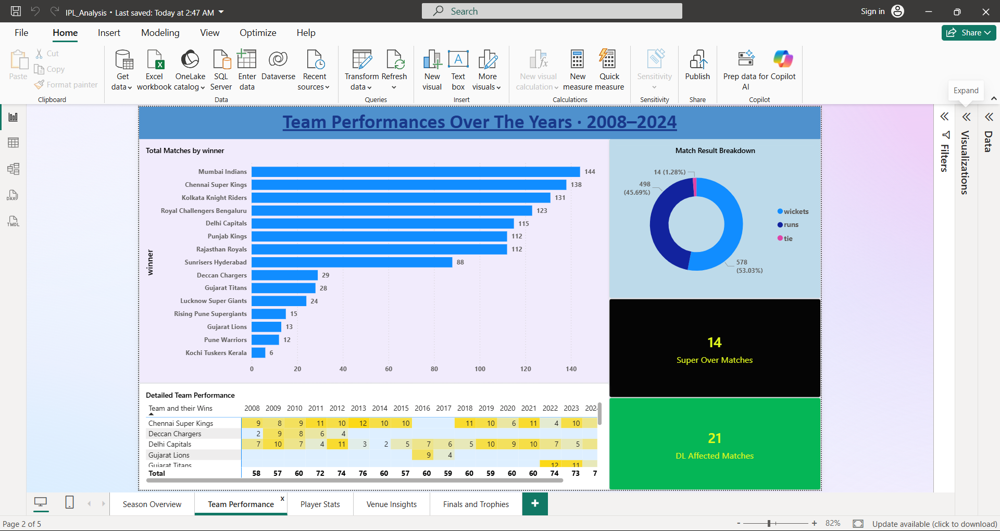
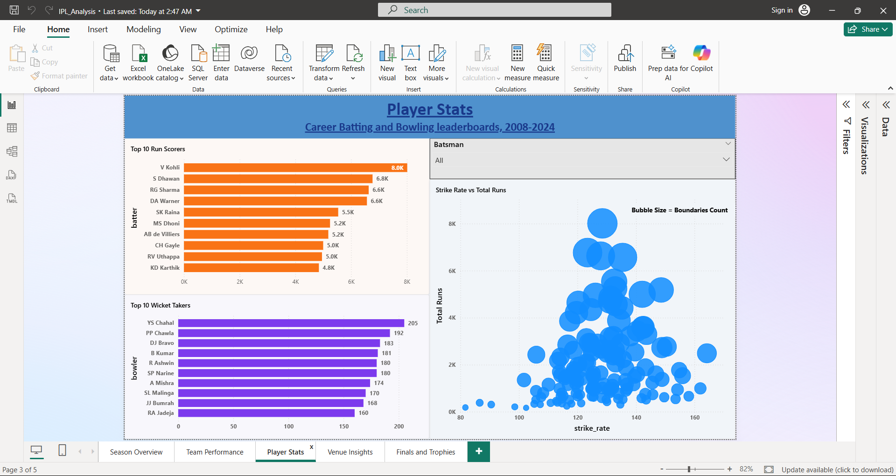
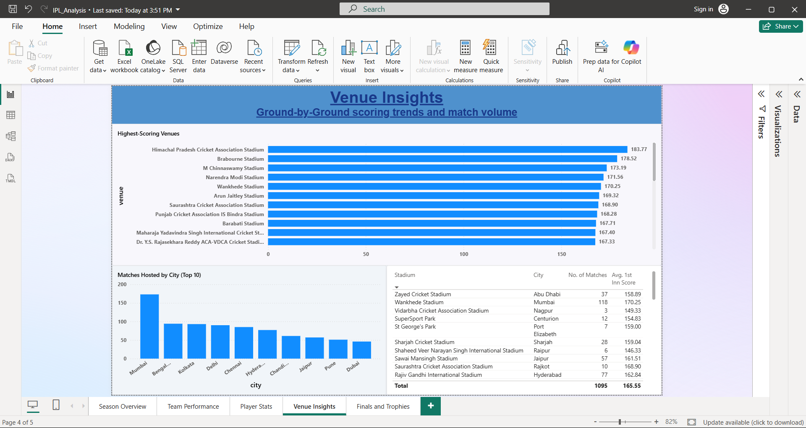
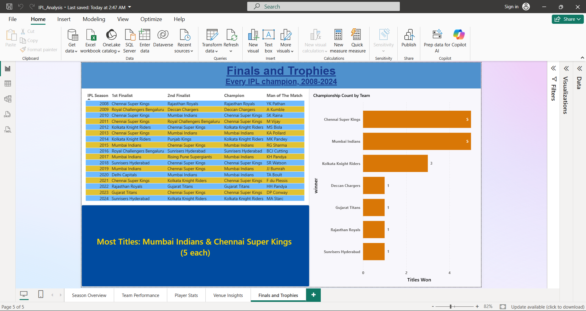

# 🏏 IPL Analytics — Python · SQL · Power BI




An end-to-end data analytics project on real Indian Premier League (IPL)
cricket data (2008–2024), covering the full pipeline: **data cleaning
(Python) → relational storage & querying (SQL) → interactive dashboard
(Power BI)**.

Built as a portfolio project to demonstrate practical data engineering and
analytics skills across the three most commonly requested tools in analyst/
data-engineering interviews.

## Contents

- [Project Overview](#-project-overview)
- [Key Insights](#-key-insights)
- [Tech Stack](#-tech-stack)
- [Repository Structure](#-repository-structure)
- [Data Source](#-data-source)
- [How to Run](#️-how-to-run)
- [Key Analyses](#-key-analyses)
- [Sample Charts](#-sample-charts)
- [Possible Extensions](#-possible-extensions)

---

## 📌 Project Overview

The dataset covers 17 IPL seasons (2008–2024): **1,095 matches** and
**260,920 ball-by-ball deliveries** — match results, toss decisions, venues,
Player of the Match awards, and every ball bowled (batting, bowling, wickets,
extras, dismissals).

This is **real historical data**, not synthetic — sourced from
[IPL Complete Dataset (2008–2024)](https://www.kaggle.com/datasets/patrickb1912/ipl-complete-dataset-20082020)
by Patrick B on Kaggle — which meant real cleaning work before it was
analysis-ready. See [`python/clean_data.py`](python/clean_data.py) for full
details; highlights:

| Issue found in raw data | How it was handled |
|---|---|
| Inconsistent season labels (`"2007/08"`, `"2009/10"`, `"2020/21"`) | Replaced with a single clean year, derived unambiguously from the match date |
| Franchise renames (same owner, new name) — e.g. `Delhi Daredevils` → `Delhi Capitals`, `Kings XI Punjab` → `Punjab Kings`, `Royal Challengers Bangalore` → `...Bengaluru` | Standardized to the current name |
| Genuinely defunct franchises (`Deccan Chargers`, `Pune Warriors`, `Gujarat Lions`, `Kochi Tuskers Kerala`) | Left as distinct historical teams — merging them into a "successor" would misrepresent history |
| Missing `city` for the 2014 UAE-leg matches | Backfilled from `venue` (Dubai / Sharjah) |
| Same physical venue renamed over time — e.g. `Feroz Shah Kotla` → `Arun Jaitley Stadium` (2018), `Sardar Patel Stadium` → `Narendra Modi Stadium` (2021), plus punctuation/sponsorship variants (`M.Chinnaswamy Stadium`, `Subrata Roy Sahara Stadium`) | Standardized to the current name, confirmed via matching city + non-overlapping season ranges before merging |
| Raw `"NA"` strings | Converted to proper `NaN` on load |
| 5 washed-out ("no result") matches with a blank `winner` | Kept as `NULL`, not dropped — real matches, no valid winner |

## 📈 Key Insights

- **Mumbai Indians** lead all-time wins (144), just ahead of **Chennai Super
  Kings** (138) and **Kolkata Knight Riders** (131)
- Teams that **field first** after winning the toss win **53.9%** of the time,
  vs. **45.4%** for batting first — the league has clearly shifted toward
  chasing
- **Himachal Pradesh Cricket Association Stadium (Dharamsala)** is the most
  batting-friendly venue among grounds with 10+ matches hosted, averaging
  **183.8** in the first innings
- **14 Super Overs** have been played across IPL history — the rarest,
  highest-drama result type in the dataset
- **V Kohli** (8,014 runs) and **YS Chahal** (205 wickets) top the all-time
  run-scoring and wicket-taking charts respectively

## 🧰 Tech Stack

| Layer            | Tool                                  |
|-------------------|----------------------------------------|
| Data cleaning       | Python (pandas, numpy)               |
| Storage & querying | SQL (SQLite, portable to MySQL/Postgres) |
| Exploratory analysis | Python (matplotlib, seaborn)       |
| Dashboard          | Power BI                             |

## 📁 Repository Structure

```
IPL-Analysis-2008-2024/
├── assets/
│   ├── banner.png                # README banner (generated by make_banner.py)
│   └── screenshots/               # PowerBI screenshots
├── data/
│   ├── raw_matches.csv          # original source data (Kaggle, see Data Source)
│   ├── raw_deliveries.csv       # original source data (Kaggle, see Data Source)
│   ├── matches.csv              # cleaned, analysis-ready (output of clean_data.py)
│   ├── deliveries.csv           # cleaned, analysis-ready (output of clean_data.py)
│   └── ipl.db                   # SQLite database (built from the cleaned CSVs)
├── python/
│   ├── clean_data.py            # cleans raw data -> matches.csv / deliveries.csv
│   ├── load_to_sql.py           # loads cleaned CSVs into SQLite (ipl.db)
│   ├── eda.py                   # exploratory analysis + chart generation
│   ├── export_for_powerbi.py    # pre-aggregated CSVs for Power BI
│   ├── make_banner.py           # generates assets/banner.png from live data
│   └── eda_charts/              # PNG charts generated by eda.py
├── sql/
│   ├── schema.sql                # table definitions
│   └── analysis_queries.sql      # 15 analytical queries
├── powerbi/
│   ├── batter_summary.csv
│   ├── bowler_summary.csv
│   └── team_season_summary.csv
├── requirements.txt
├── LICENSE
└── README.md
```

## 📥 Data Source

This project uses the [**IPL Complete Dataset (2008–2024)**](https://www.kaggle.com/datasets/patrickb1912/ipl-complete-dataset-20082020)
by Patrick B, published on Kaggle. It contains two files:
- `matches.csv` — 1,095 rows, one per match
- `deliveries.csv` — 260,920 rows, one per ball bowled

Both the original and cleaned versions are included in `data/` in this repo.

**Data license:** the dataset is licensed under the [Database Contents License (DbCL) v1.0](https://opendatacommons.org/licenses/dbcl/1.0/),
which incorporates the [Open Database License (ODbL)](https://opendatacommons.org/licenses/odbl/) —
requiring attribution and that redistributed/derived data stay openly available.
This repository satisfies both: it's public, and credit is given here. Note
this license applies to the **data files only** — the code in this repository
(Python, SQL, DAX) is separately licensed under MIT, see [`LICENSE`](LICENSE).

## ⚙️ How to Run

```bash
# 1. Clone the repo
git clone https://github.com/TedMata13/IPL-Analysis-2008-2024
cd IPL-Analysis-2008-2024

# 2. Install dependencies
pip install -r requirements.txt

# 3. (Raw CSVs are already in data/ -- re-download from Kaggle only if you
#    want to verify against a fresh copy) Clean the raw data:
python python/clean_data.py

# 4. Load it into a SQL database
python python/load_to_sql.py

# 5. Run exploratory analysis (produces charts in python/eda_charts/)
python python/eda.py

# 6. Export Power BI-ready CSVs
python python/export_for_powerbi.py

# 7. (optional) Regenerate the README banner from current data
python python/make_banner.py
```

Then open `IPL_Analysis.pbix` directly in Power BI Desktop to explore the full dashboard, including every DAX measure, the drillthrough page, and conditional formatting. 

To run the SQL queries directly:
```bash
sqlite3 data/ipl.db < sql/schema.sql
sqlite3 data/ipl.db
.read sql/analysis_queries.sql
```

## 🔍 Key Analyses

- **Team performance** — win counts & win % across 17 seasons
- **Player stats** — top run scorers (V Kohli leads with 8,014 runs), top wicket
  takers (YS Chahal leads with 205), strike rate & economy leaders
- **Toss impact** — does winning the toss actually help win the match?
- **Venue trends** — which grounds are the most batting-friendly?
- **Match phases** — powerplay vs. middle-overs vs. death-overs scoring rates
- **Closest finishes** — matches decided by the smallest margins
- **Super Overs** — every tie-breaker in IPL history
- **D/L-affected matches** — rain-curtailed games by season
- **Finals history** — season-by-season champions

Full query list: [`sql/analysis_queries.sql`](sql/analysis_queries.sql)

## 📊 Sample Charts

Generated by `python/eda.py` — see `python/eda_charts/` for all 6:

- Matches played per season
- Total wins by team
- Top 10 run scorers / wicket takers
- Toss decision trend by season
- Average first-innings score by venue

## 📈 Dashboard Preview





The full `.pbix` file is included at the repo root — open it directly in Power BI Desktop to explore the live model.

## 🚀 Possible Extensions

- Add a player-clustering model (batting style, role) using scikit-learn
- Deploy the SQL layer on a cloud database (Azure SQL / PostgreSQL) and connect
  Power BI live instead of via CSV import
- Add a Streamlit app as a lightweight alternative front-end to Power BI
- Pull in ball-tracking / player-salary data for deeper value-for-money analysis

## 📝 License

The **code** in this repository (Python, SQL, DAX, Power BI build) is released
under the MIT License — see [`LICENSE`](LICENSE) — free to use, modify, and
build on for your own portfolio.

The underlying **IPL match data** is from Kaggle's [IPL Complete Dataset (2008–2024)](https://www.kaggle.com/datasets/patrickb1912/ipl-complete-dataset-20082020)
by Patrick B, licensed under the [Database Contents License (DbCL) v1.0](https://opendatacommons.org/licenses/dbcl/1.0/)
(incorporating the [ODbL](https://opendatacommons.org/licenses/odbl/)) —
attribution required, redistribution must stay open. This repo satisfies both.
